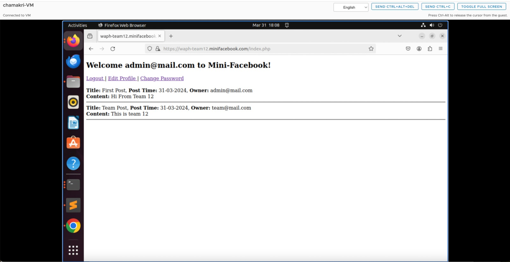

# WAPH-web Application programming and Hacking

## Instructor: Dr. Phu Phung

# Team Members

1. Ragini, Chamakura
2. Sreeja, Bodanapu
3. Akhil Kumar Yadav, Markoll

# Project Management Information

Source code repository (private access): [Team repository](https://github.com/waph-team12/waph-teamproject)

Project homepage (public): [Public repository for team project](https://github.com/waph-team12/waph-team12.github.io)

## Revision History

| Date 		| Version | Description |
|---------------|---------|-------------|
| 24/03/2024    |   0.0	  | Init draft  |
| 31/03/2024    |   0.1	  | Sprint 1   |
| 10/04/2024    |   0.2	  | Sprint 2   |
| 25/04/2024    |   0.3	  | Sprint 3   |

# Overview

For Sprint 0, we have completed the setup for the team project, which includes configuring SSL and HTTPS domains. Additionally, we implemented a basic login system and set up the database.

For Sprint 1, we enhanced the system by adding features such as user registration, password change functionality, user profile editing, and post viewing on the home page. To support these features, we extended the database schema by creating new tables for posts and adding necessary columns for registration. We implemented session authentication to remember logged-in users and implemented defense mechanisms against CSRF attacks. Furthermore, we optimized SQL code for database modifications and consolidated it into a single 'database.php' file to improve reusability.

For Sprint 2, we introduced several new features to our application. Authenticated users can now create new posts, add comments to existing ones, and view comments made by others. Users are also able to edit or delete their own posts, while safeguards prevent unauthorized modification or deletion of posts created by others. Additionally, we have implemented intuitive styling using Bootstrap CSS for a responsive and visually appealing interface. Furthermore, to enhance security, comprehensive validation mechanisms have been integrated both client-side and server-side, mitigating potential vulnerabilities and ensuring data integrity throughout the application.

For Sprint 3, we have added role specific access control throught the application. Here we have 2 roles, one is a super user and other is a regualr user. Super user cannot register from the application, they are directly added to database. A logged in super user can view the list of all the registered users. Super user has ability to disable or enable any registered user login. A regular user disabled by super user cannot login to the application unless superuser enables them.

# System Analysis

## High-level Requirements

Will be creating a Mini-Facebook system, for users to have ability to login, post content and comment on other posts and role specific access control

# Demo (screenshots)
## Sprint 0
Below screenshots depict the proces of login system that is working on HTTPS team's local domain:  


Screenshot demos of index.html of each team member on HTTPS team's local domain:  


## Sprint 1
Below screenshots depict the process of registration(adding new user to the system):  

  

  


Below screenshots depict success of login to home page:  

  

 
Below screenshots depict the process of changing password for the user:  

  


  


Below screenshot depict the process of edit profile for the user:  

  


Below screenshot depict successful logout of user:  

  


Below screenshot depict successful defense against CSRF attack:  

  


## Sprint 2
Below screenshot show new home page which displays user profile details and all posts. Each post redirects to a separate page for viewing comments. Additionally, there's a link to add new posts:  

  

Below screenshot show add new post page, here logged in user can add a new post:  

  


Below screenshots shows successful addition of new post and display of new post on home page:  

  


  


Below screenshots shows post page which displays all the comments, and has a form to add new comment:  

  


Below screenshots shows post page after successful addition of comment to this page:  


Below screenshots shows user post page which displays all the users posts and gives ability to edit or delete their post:  


Below screenshots shows edit post page where a user can edit their posts:  

  


Below screenshots shows successfully edited post page on your posts page:  

  


Below screenshots shows your posts page after successful deletion of a user post:  

  

## Sprint 3
Below screenshot show role specific access control added to the system along with login page of super user:  

  

Below screenshot show new home screen for super users, this displayed UserName and Full Name of registered users along with abilities to enable/disable them:  

  


Below screenshots shows disable functionality done by super user:  

  


  

# Software Process Management

We are using Agile methodologies here where complete project is divided into Sprints, with requirements divided for each sprint. These requirements are divided among team members to complete their sprint tasks.

## Scrum process

### Sprint 0

Duration: 18/03/2024-24/03/2024

#### Completed Tasks: 

1. Created organization with repositories needed for team project
2. Did SSL, HTTPS setup for this project
3. Created Database with users, messages, send and recieve tables
4. Create a simple login system with form.php and index.php
   
#### Contributions: 

1. Member 1, created private repository, updated index.html, SSL key creation, Simple login system
2. Member 2, created public repository,  updated index.html, Database account creation
3. Member 3, updated README file, updated index.html, Database data and tables creation

#### Sprint Retrospection:

| Good     |   Could have been better    |  How to improve?  |
|----------|:---------------------------:|------------------:|
|     Since this is first sprint, got to know team members and team had good coordination     |            Time Management                 |                |

### Sprint 1

Duration: 25/03/2024-31/03/2024

#### Completed Tasks: 

1. Updated database to support new user registrations and added table for posts
2. Created features to support viewing posts and added new pages for edit profile, change password
3. Optimised all the SQL code into a single file for reusability
4. Implemented session authentication and defense against Session Hijacking and CSRF attacks.
   
#### Contributions: 

1. Member 1, updated databases
2. Member 2, created new pages and updated existing pages to support new
features
3. Member 3, implemented defense mechanism and session authentication

#### Sprint Retrospection:

| Good     |   Could have been better    |  How to improve?  |
|----------|:---------------------------:|------------------:|
|     Good new understanding of implementation on CSRF and did great team collaboration |           Need to work on CSS            |       Better time management         |

### Sprint 2

Duration: 01/04/2024-10/04/2024

#### Completed Tasks: 

1. Added CSS for entire application, and made sure client-side and server-side validations are in place.
2. Added new post page to users to add posts.
3. Users can also view their own posts, edit or delete their own posts.
4. Users can view any posts and added comments to those posts.
   
#### Contributions: 

1. Member 1, added CSS, client and server-side validations
2. Member 2, created pages to add new post, add comments on any post
3. Member 3, created features to view user posts and update(edit/delete) them

#### Sprint Retrospection:

| Good     |   Could have been better    |  How to improve?  |
|----------|:---------------------------:|------------------:|
|     Great time-management, started sprint early and focused on pending work     |           Everything looks good so far                |                |

### Sprint 3

Duration: 11/04/2024-25/04/2024

#### Completed Tasks: 

1. Added role specific access control for super users.
2. Added home page based on user role, with inline styling same as other pages. 
3. Modified SQL to add super users and their abilities to enable/disable regular users.
4. Modified login functionality based their enabled status.
   
#### Contributions: 

1. Member 1, modified home page based on user role and added CSS
2. Member 2, modified database to add super user abilities
3. Member 3, modified login functonality

#### Sprint Retrospection:

| Good     |   Could have been better    |  How to improve?  |
|----------|:---------------------------:|------------------:|
|     Focused on implementing important features and deliverables  |           Not able to complete chat system as planned               |       Better time management         |

# Final Report 

# Demo
Functionalities of the application are demonstrated, which include new user registration, login, abilities to change password, edit password, add new post, updating user-specific posts and adding comments to posts for any authenticated user. It also includes login of superusers, with abilities to view all registered users and enable/disable these users. Defense mechanism against XSS, SQL injection, Session Hijacking and CSRF attacks is also demonstrated. Below is the link for demo video:  

[Demo](https://mailuc-my.sharepoint.com/:v:/g/personal/bodanasa_mail_uc_edu/EfOUXdfIgO9EgpcRfIBPDgMB4DMvLniqi18-mW6mu52New?nav=eyJyZWZlcnJhbEluZm8iOnsicmVmZXJyYWxBcHAiOiJPbmVEcml2ZUZvckJ1c2luZXNzIiwicmVmZXJyYWxBcHBQbGF0Zm9ybSI6IldlYiIsInJlZmVycmFsTW9kZSI6InZpZXciLCJyZWZlcnJhbFZpZXciOiJNeUZpbGVzTGlua0NvcHkifX0&e=I8sLSI)  

# Security and Non-Functional Requirements

## The system deployed on HTTPS

We have deployed this MiniFacebook application on https using SSL keys. Below screenshot shows Home Page of MiniFacebook deployed on HTTPS:  

  

## Passwords hashed in the database and no MySQL root account used for the PHP code

We made sure to hash passwords saved in database using MD5 hashing technique. Below screenshot shows values in users table with hashed passwords:  

  

We made sure database is not access from MySQL root account, it is accessed from specific user which is 'waph-team12'. Below screenshot shows no MySQL root access:  

  

## All SQL executed in Prepared Statements

All the SQL modifications are done in database.php and prepared statements are used for any SQL modification. Below screenshot shows prepared statement usage:  

  

## All inputs are validated in every layer: HTML, PHP, and SQL

Inputs are validated through out application. We made sure to input validations in HTML using regex pattern matching for required fields. Below screenshot shows input validation in HTML:  

  

Input sanitization is done in PHP by resuing the function to trim input, remove html special characters. Below screenshot shows input validation in PHP:  

  

## HTML outputs are sanitized

HTML outputs are sanitized at every stage using htmlentities. Below screenshot shows html output sanitized:  

  

## Role-based access control for registered users and super users

Application has ability to display features based on user role, this is done saving role using role-based access control. A super user cannot register into application, they are directly added from database and have ability to enable/disable regular users.

### A regular user cannot log in as a superuser

Regular users cannot log in as super user, without having credentials. Below screenshot shows Home page of regular user displaying posts and ability to posts and comments:  

  

Below screenshot shows Home page when logged in as super user, with abilities to enable/disable a regular user:  

  

### A regular user cannot edit/update posts of other users

Any regular user logged in can view posts from all users. Application also provides ability to edit/delete user specific posts. Below screenshot shows 'Your Posts' page having abilities to edit/delete only their posts:  

  

## Session Authentication and Hijacking Prevention

User session based on user role is saved accross the application, this helps user navigate through different pages with saved session data. To prevent session hijacking we are setting session cookie parameters of HTTPOnly and Secure to true, we are also validating session browser at every stage. Below screenshot shows empty cookie which prevents session hijacking:  

  

## CSRF Protection

Application is protected against CSRF attacks. A token named 'nocsrftoken' is set on specific pages and subsequently validated to prevent any potential CSRF attacks. Below screenshot shows successful defense against CSRF attack on changepassword page:  

  

## Integrating an open-source front-end CSS template

We have used open spurce CSS to create an interactive UI design for our application. This code is referenced from below site, we have separated the style code in styles.css and used this throughout the application for styling.  

[CSS](https://bbbootstrap.com/snippets/bootstrap-5-login-form-using-neomorphism-89456141)  

Below screenshot shows styled Home Page using this CSS, the style is maintained consistently throughout the application:  

  


# Appendix
Code of this project can be found at: [Team repository](https://github.com/waph-team12/waph-teamproject)

Code of database/database-account.sql:
```sql
create database waph_team;
CREATE USER 'waph-team12'@'localhost' IDENTIFIED BY 'Pa$$w0rd';
GRANT ALL ON waph_team.* TO 'waph-team12'@'localhost';
```
Code of database/database-data.sql:

```sql
DROP TABLE IF EXISTS users;

CREATE TABLE users (
    username VARCHAR(50) PRIMARY KEY,
    password VARCHAR(100) NOT NULL,
    fullname VARCHAR(100) NOT NULL,
    mail VARCHAR(100) NOT NULL,
    phone VARCHAR(100) NOT NULL
);

LOCK TABLES users WRITE;
INSERT INTO users VALUES ('admin@mail.com', MD5('admin'), 'team admin', '', '');
UNLOCK TABLES;

DROP TABLE IF EXISTS posts;

CREATE TABLE posts (
    post_ID VARCHAR(50) PRIMARY KEY,
    title VARCHAR(100) NOT NULL,
    content VARCHAR(100) NOT NULL,
    post_time VARCHAR(100) NOT NULL,
    owner VARCHAR(100) NOT NULL,
    FOREIGN KEY (owner) REFERENCES users(username) ON DELETE CASCADE
);

LOCK TABLES posts WRITE;
INSERT INTO posts VALUES ('1', 'First Post', 'Hi From Team 12', '31-03-2024', 'admin@mail.com');
UNLOCK TABLES;
```
Code of form.php
```php
<!DOCTYPE html>
<html lang="en">
<head>
  <meta charset="utf-8">
  <title>WAPH Team-Login page</title>
  <script type="text/javascript">
      function displayTime() {
        document.getElementById('digit-clock').innerHTML = "Current time:" + new Date();
      }
      setInterval(displayTime,500);
  </script>
</head>
<body>
  <h1>WAPH Team-Login page</h1>
  <h2>Mini-Facebook login Name</h2>
  <div id="digit-clock"></div>  
<?php
  //some code here
  echo "Visited time: " . date("Y-m-d h:i:sa")
?>
  <form action="index.php" method="POST" class="form login">
    Username:<input type="text" class="text_field" name="username" /> <br>
    Password: <input type="password" class="text_field" name="password" /> <br>
    <button class="button" type="submit">Login</button>
  </form>
</body>
</html>
```

Code of index.php
```php
<?php
require "database.php";
// Start the session
session_set_cookie_params(15*60,"/","waph-team12.minifacebook.com",TRUE,TRUE);
session_start();

// Check if the username and password are posted
if(isset($_POST["username"]) && isset($_POST["password"])) {
    // Validate login credentials
    if (checklogin_mysql($_POST["username"],$_POST["password"])) {
        // Set session variables
        $_SESSION["authenticated"] = TRUE;
        $_SESSION["username"] = $_POST["username"];
        $_SESSION["browser"] = $_SERVER["HTTP_USER_AGENT"];
    } else {
        // Invalid credentials, destroy session and redirect
        session_destroy();
        echo "<script>alert('Invalid username/password');window.location='form.php';</script>";
        die();
    }
}

// Check authentication status
if(!isset($_SESSION["authenticated"]) || $_SESSION["authenticated"] !== TRUE) {
    // Not authenticated, destroy session and redirect
    session_destroy();
    echo "<script>alert('You have not logged in. Please login first!');</script>";
    header("Refresh: 0; url=form.php");
    die();
}

// Check for session hijacking
if(isset($_SESSION["browser"]) && isset($_SERVER["HTTP_USER_AGENT"]) && $_SESSION["browser"] !== $_SERVER["HTTP_USER_AGENT"]) {
    echo "<script>alert('Session hijacking is detected!');</script>";
    header("Refresh: 0; url=form.php");
    die();
}

?>
<!DOCTYPE html>
<html lang="en">
<head>
  <meta charset="utf-8">
  <h2> Welcome <?php echo htmlentities($_POST['username']); ?> to Mini-Facebook!</h2>
</head>
<body>
  <a href="logout.php">Logout </a> |
  <a href="profileform.php">Edit Profile </a> |
  <a href="changepasswordform.php">Change Password</a>
  <div style="margin-top: 20px;">
    <?php display_posts(); ?>
  </div>
</body>
</html>
```

Code of database.php
```php
<?php
  	$mysqli = new mysqli('localhost' ,'waph-team12', 'Pa$$w0rd', 'waph_team');
		if ($mysqli->connect_errno) 
		{
			printf("Database connection failed; %s\n", $mysqli->connect_errno);
			exit();
		}

	function addnewuser($username, $password, $fullname, $mail, $phone) {
		global $mysqli;
		$prepared_sql = "INSERT INTO users (username,password,fullname,mail,phone) VALUES (?, md5(?), ?, ?, ?);";
		$stmt = $mysqli->prepare($prepared_sql);
		$stmt->bind_param("sssss", $username, $password, $fullname, $mail, $phone);

		if($stmt->execute())
			return TRUE;
		return FALSE;
  	}

	function checklogin_mysql($username, $password) {
    	global $mysqli;
		$prepared_sql = "SELECT * FROM users WHERE username = ? AND password = md5(?)";
    	$stmt = $mysqli->prepare($prepared_sql);
    	$stmt->bind_param("ss", $username, $password);
    	$stmt->execute();
    	$result = $stmt->get_result();

    	if($result->num_rows == 1)
        	return TRUE;
    	return FALSE;
	}

	function editprofile($username, $fullname, $mail, $phone) {
	 	global $mysqli;
		$prepared_sql = "UPDATE users SET fullname = ?, mail = ?, phone = ? WHERE username = ?;";
    	$stmt = $mysqli->prepare($prepared_sql);
    	$stmt->bind_param("ssss", $fullname, $mail, $phone, $username);

    	if($stmt->execute())
      		return TRUE;
    	return FALSE;
    }

    function changepassword($username, $password) {
    	global $mysqli;

    	$prepared_sql = "UPDATE users SET password = md5(?) WHERE username = ?;";
    	$stmt = $mysqli->prepare($prepared_sql);
    	$stmt->bind_param("ss", $password, $username);

    	if($stmt->execute())
      		return TRUE;
    	return FALSE;
    }

	function display_posts() {
    global $mysqli; // Assuming $mysqli is defined globally elsewhere in your code

    // Query to fetch all posts
    $query = "SELECT title, content, post_time, owner FROM posts";
    $result = $mysqli->query($query);

    $htmlContent = "";

    if ($result && $result->num_rows > 0) {
        // Loop through each row of the result set
        while ($row = $result->fetch_assoc()) {
            // Format the output: title, post_time, owner in bold on one line, content on the next line
            $htmlContent .= "<div><strong>Title:</strong> " . $row['title'] . ", <strong>Post Time:</strong> " . $row['post_time'] . ", <strong>Owner:</strong> " . $row['owner'] . "</div>";
            $htmlContent .= "<div><strong>Content:</strong> " . $row['content'] . "</div> <hr>";
        }
    } else {
        $htmlContent = "No posts found";
    }

    echo $htmlContent;
}

?>
```
